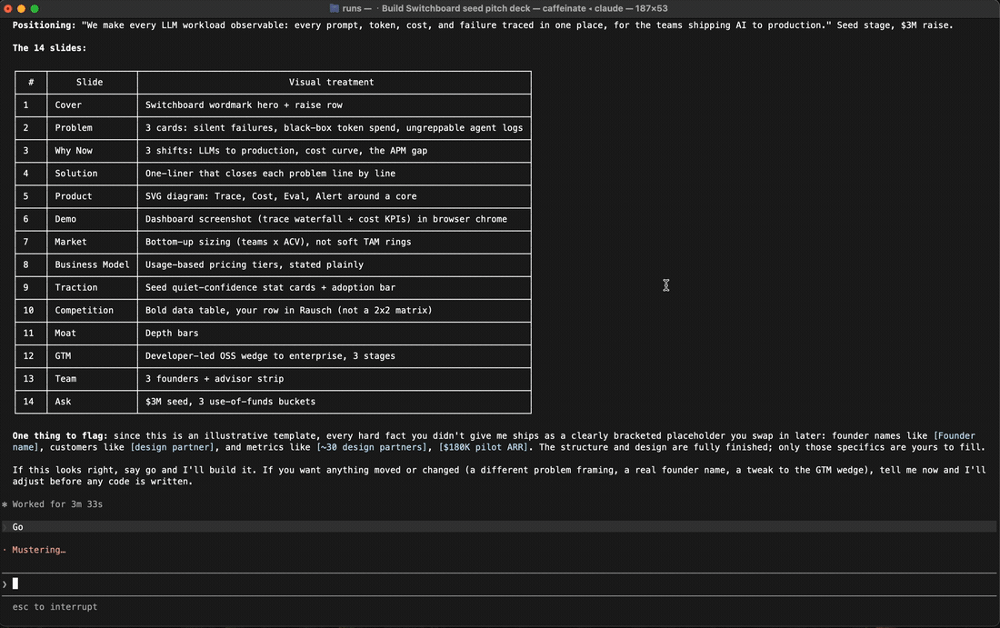
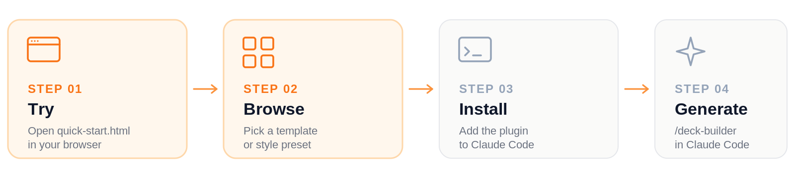
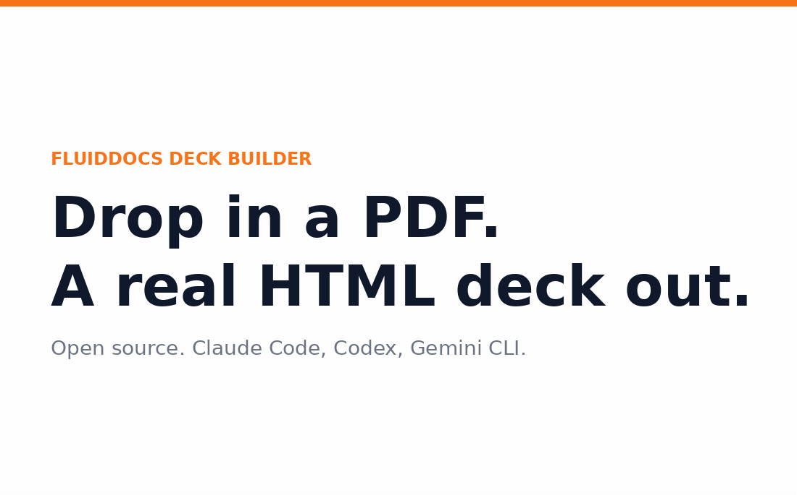
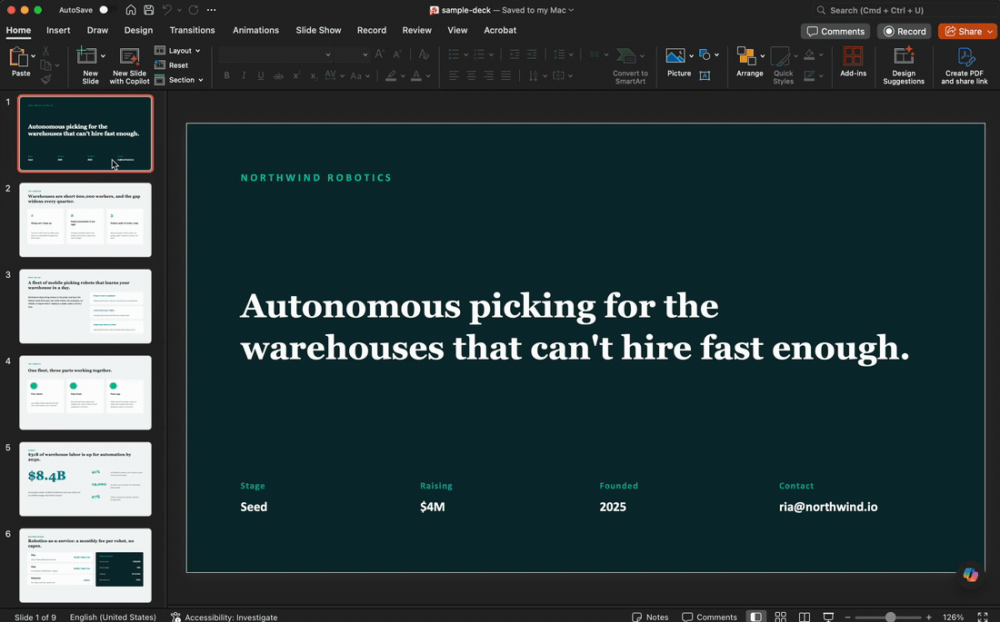
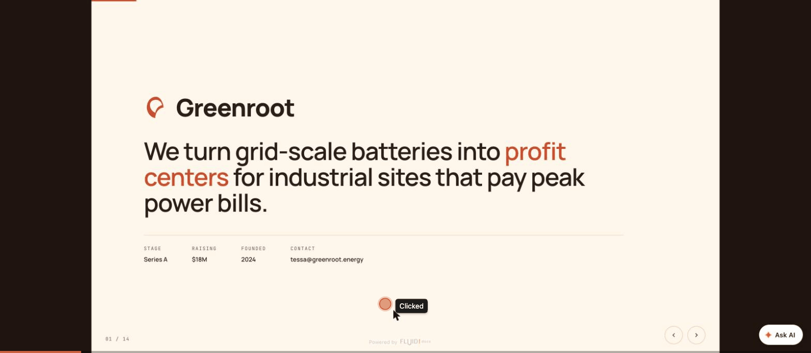

# FluidDocs Deck Builder

[](https://github.com/FluidForm-ai/fluiddocs-deck-builder/stargazers) [](LICENSE) [](https://github.com/FluidForm-ai/fluiddocs-deck-builder) [](#manual-install-any-agent-that-reads-skillmd)


**Describe a deck and get one built. Or drop in an old PDF or PPTX to rebuild it. Either way: a polished, interactive HTML deck.**



An open-source deck builder for coding agents. Five type-correct deck spines (pitch, sales, launch, keynote, all-hands) build from a one-line brief, and `deck-import` rebuilds an existing PDF or PPTX. Four brand-mirror pitch templates, inline editing, and a multi-reviewer quality pipeline. Single-file HTML output, zero dependencies in the deck itself.

"Interactive" means each deck is one self-contained HTML file you navigate with arrow keys and edit in place: press `E`, click any element, type your change, then `Ctrl`/`Cmd`+`S` to download your edited copy. No server, no build step, no account.

Maintained by [FluidDocs](https://fluiddocs.ai). MIT licensed.

---

## Try it in 30 seconds, no install

Open [`quick-start.html`](./quick-start.html) in your browser. A live Stripe pitch deck loads in an embedded preview. Press `E` inside the deck to enter edit mode. Edit any heading. Press `Ctrl`/`Cmd`+`S` to download your version.

That is the whole loop. No signup, no CLI, no server. The HTML file you download is yours to ship, host, or fork.



---

## Browse templates

Eight templates ready to fork. Four brand-mirror pitch decks (Airbnb, Stripe, Anthropic, Sequoia Classic) and four type defaults (sales, launch, keynote, all-hands).

Open [`templates/index.html`](./templates/index.html) for the full gallery with filters by type.

Six style presets cover the case where you do not have a brand to mirror. Open [`style-presets/index.html`](./style-presets/index.html) to pick one.

---

## Install for real

### One-line install (Claude Code)

```bash
/plugin marketplace add FluidForm-ai/fluiddocs-deck-builder
/plugin install fluiddocs-deck-builder@fluiddocs-deck-builder
```

Then invoke any skill:

```
/fluiddocs-deck-builder:deck-builder
/fluiddocs-deck-builder:deck-pitch
/fluiddocs-deck-builder:deck-import
```

### Manual install (any agent that reads SKILL.md)

Works with Codex, Kimi Code, OpenCode, Gemini CLI, and any other agent that follows the SKILL.md convention.

Claude Code reads personal skills from `~/.claude/skills/<name>/`, so copy the skill folders directly into that directory:

```bash
git clone https://github.com/FluidForm-ai/fluiddocs-deck-builder.git /tmp/fluiddocs-deck-builder
cp -r /tmp/fluiddocs-deck-builder/skills/* ~/.claude/skills/
cp -r /tmp/fluiddocs-deck-builder/scripts ~/.claude/skills/deploy/
```

The second copy puts `deploy.sh` where the `deploy` skill looks for it, so publishing works on the manual install too. The plugin install bundles it automatically.

For other agents, clone the repo and point your agent at its `skills/` directory per that tool's own SKILL.md convention.

---

## Generate a new deck from scratch

After install, invoke the deck-builder skill and describe what you want. With the plugin install the command is `/fluiddocs-deck-builder:deck-builder`. With the manual install it is `/deck-builder`.

Sample prompts that work out of the box:

```
Build me a 14-slide seed pitch for Switchboard, an observability layer
for LLM workloads. Use the tech-crisp preset.
```

```
Build a 12-slide launch deck for the v2 release of our analytics product.
Studio Bold preset. Hero, what's new, availability, CTA.
```

```
Import this PDF and rebuild it as an interactive HTML deck with the
original screenshots preserved.
```

The skill walks the brief through intake, builds, runs three reviewers (Brand, Copy, Layout), and ships a single self-contained HTML file.

---

## Deploy your deck

Once you have a generated `.html` file, `scripts/deploy.sh` uploads it to [fluiddocs.ai](https://fluiddocs.ai) and returns a public, shareable URL. Auth happens once in your browser; the token is cached at `~/.config/fluiddocs/auth.json` and reused on subsequent deploys.

**Always pass `--name "Your Friendly Name"`.** Without it, the project shows up in your FluidDocs dashboard as the raw filename slug (e.g. `mushee-seed-pitch`), which is hard to scan later. With it, you get a real title (e.g. `Mushee · Seed Pitch`).

```bash
# From the directory containing your deck HTML
cd path/to/your/deck
bash /path/to/fluiddocs-deck-builder/scripts/deploy.sh --name "Mushee · Seed Pitch"
```

The script:

- Finds all `.html` files in the current directory (top-level only) and prompts you to pick one if there's more than one
- Opens your browser to sign in to FluidDocs the first time (5-minute window)
- Uploads the file under the friendly name you passed via `--name`, prints the deploy URL, and writes a `.fluid-docs.json` state file mapping the local filename to its project ID so subsequent deploys overwrite the same project instead of creating a new one
- Opens the deployed URL in your default browser at the end so you can verify the live deck immediately (pass `--no-open` to suppress)

Useful flags:

```bash
bash scripts/deploy.sh --name "My Deck"               # friendly project name (always use this)
bash scripts/deploy.sh --no-open                      # skip opening the deploy URL after upload
bash scripts/deploy.sh --host http://localhost:8080   # deploy to a local FluidDocs server
bash scripts/deploy.sh --logout                       # clear cached credentials
bash scripts/deploy.sh --help                         # full usage
```

The browser opens twice in the typical flow: once for the first-time sign-in URL, and once for the deployed deck URL at the end. Both are handled by the same cross-platform helper (`open` on macOS, `xdg-open` on Linux, `explorer.exe` on Windows). If your environment can't auto-open, the URL is printed to stdout so you can paste it yourself.

You can also set the server via env var: `FLUIDDOCS_URL=https://fluiddocs.ai bash scripts/deploy.sh --name "My Deck"`.

For a one-off deploy of a deck that lives alongside others (e.g. `examples/built-decks/`), stage it in a clean directory first so the script has exactly one HTML to pick:

```bash
mkdir -p /tmp/my-deploy
cp examples/built-decks/my-deck.html /tmp/my-deploy/
cd /tmp/my-deploy && bash /path/to/scripts/deploy.sh --name "My Deck"
```

---

## What's in the pack

Five type-correct deck builders, each with the right slide count and content spine for the job:

| Skill | Slides | Use for |
|---|---|---|
| **deck-pitch** | 14 | Investor pitches. Ships with 4 brand-mirror templates (Airbnb, Stripe, Anthropic, Sequoia Classic). |
| **deck-sales** | 11 | B2B pitch-to-close. Pain, demo, proof, pricing, next steps. |
| **deck-launch** | 12 | Product announcements. Hero, what's new, availability, CTA. |
| **deck-keynote** | 28 | Conference talks. Narrative arc, one idea per slide, mandatory opening hook. |
| **deck-all-hands** | 15 | Town halls. Wins, candor, financials, Q&A placeholder. |

Plus two utilities:

- **deck-import** · point it at a PDF or PPTX, get back a clean interactive HTML deck.
- **deck-critique-lite** · 5 to 7 plain-language observations on a pitch deck. No numerical scoring.

Every generated deck is a single self-contained HTML file. Renders on a fixed 1440 by 810 canvas (PDF-like, chrome-free, scale-to-fit). Edits inline by pressing `E` or hovering the top-left hotzone. Autosaves to localStorage. Press Ctrl/Cmd+S to download.

---

## Why this exists

Three things most LLM-built decks get wrong, and what this pack does about them.

### 1. Type-correct deck spines

A pitch is not a sales deck is not an all-hands. Each has a different audience, different success criteria, different slide order. Most agents write 14 slides that read like a Notion page. This pack ships a content spine per deck type, audited against decks that actually shipped and closed rounds.

### 2. PDF and PPTX import

Most slide tools assume you're starting from a blank canvas. Real users have a deck. They want it cleaned up, made navigable and editable, ported to the web, not rebuilt from scratch. `deck-import` auto-detects the input format, extracts the structure, classifies the slide types, and rebuilds in HTML with your original screenshots preserved.

### 3. Multi-reviewer quality pipeline

Three reviewers (Brand, Copy, Layout) sign off on every deck before release. When the underlying agent supports subagents, each reviewer runs in parallel. When it doesn't, they run sequentially. Either way, you get a deck that's been read by three different lenses before you see it.

---

## Demo GIFs

**Import a static PDF, get a navigable, editable HTML deck.** Before, then after.



**Same for PPTX.**



**Edit any deck inline.** Press `E`, click any element, type, then `Ctrl`/`Cmd`+`S` to download your copy.



---

## Host it free with FluidDocs

The builder is fully standalone: every deck is a self-contained HTML file you own, no account required. If you also want it online, [FluidDocs](https://fluiddocs.ai) hosts the same HTML. Create a **free account** and publish your deck at a shareable link. On that free tier you also get, on the hosted deck, **AI Q&A** (readers ask your deck questions and get AI answers), on-demand summaries, view analytics, and editing in the app that updates the same link instantly, all within monthly limits.

**FluidDocs Pro** raises those limits and adds more storage, viewer identity, and unbranded exports.

The builder needs neither. Hosting is the optional, free-to-start next step.

---

## Contributing

PRs welcome. Issues welcome. Translation PRs especially welcome. See [CONTRIBUTING.md](./CONTRIBUTING.md) for the guidelines.

---

## License

MIT. Use it, fork it, ship it.
